#  `HTTP` `JSP` `Servlet` `XHR비동기통신` 수업 내용


## 서버-클라이언트

- 웹서버: 정적 HTML 페이지 요청에 응답하기 위한 서버
- 웹애플리케이션 서버: 정적 HTML 페이지 + 동적인 요청(DB 서버 사용자 조회, 저장 등)에 응답 가능한 서버

### HTTP 프로토콜
- 에러 코드
    - HTTP Status 404 – Not Found : 서버 url 을 찾을 수 없을 때 발생
        
        **에러 원인**
        1. 권한 부족 
        2. 서버 자체에서 오류가 발생한 경우 리소스 반환이 안되는 경우
        3. 리다이렉션(페이지 이동 설정) 오류
        4. 리소스가 서버에 존재하지 않는 경우
        5. URL 오류 : 오타, directory 파일 이름 등 확인 


### 동적 웹애플리케이션의 구조

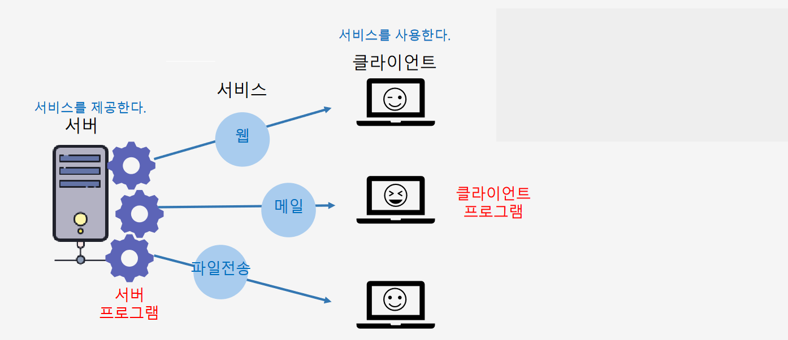

### 개발환경 Eclipse 셋팅

1. 작업 공간 workspace 생성
2. 이클립스 실행: eclipse.exe
    - 이클립스 인코딩: ISO-10646/Unicode(UTF-8) 셋팅
        - Window > Preference > General > Workspace
        - Window > Preference > Web: HTML, CSS, JSP Files
3. 웹 애플리케이션 서버(WAS) 설정 순서
    - Apache Tomcat 9.0 추가
        1. WAS 생성하는 순서
            1. Server 뷰(View)로 가기
            2. 새 서버 추가: 마우스 오른쪽 버튼 클릭 > New > Server
            3. 서버 유형 선택: 'Server type' 서버 타입 선택 창 > Apache 카테고리 선택 > Tomcat v9.0 Server 선택 > Next 클릭
            4. 서버 실행환경 셋팅
                - Server's host name: 웹애플리케이션을 테스트하기 위한 주소를 입력 ex) localhost
                - Server name: 식별 가능한 서버의 이름을 입력
                - Server location: Apache Tomcat 설치 경로를 설정
                    - JRE(Java Runtime Environment) 선택: 서버가 사용할 JRE를 선택 (보통 이클립스 기본 JRE 선택)
            5. 서버 추가 완료
            6. 웹애플리케이션 서버(Apache Tomcat) 실행
                - Server 뷰 > 서버 선택 > 'Start the server' 버튼을 클릭
            7. 실행 중인 웹애플리케이션 확인
                - 브라우저 > 'http://localhost:포트번호/' 접속
                - Apache Tomcat 서버에서 실행 중인 웹 애플리케이션 확인


### `lombok.jar` 실행 파일 경로 Eclipse 에 셋팅 
1. 프로젝트 directory 마우스 오른쪽 클릭 > Build Path > Configure Build Path
2. Libriaries 창 Modulepath, Classpath 중 Classpath 선택

    **Classpath 와 Modulepath 개념** 
    - Modulepath : 무조건 하나의 모듈(`프로젝트`)에
    - Classpath : 


4. 서버를 사용하는 동적 웹프로젝트 생성
                    
    **현재 perspective(상단 우측 아이콘) 가 Java EE 상태인지 확인**

    1. File > New > Dynamic Web Project 클릭 
    2. Project name : 프로젝트 이름 입력

5. 데이터베이스 연결

    **Perspective : Data Source Explorer**

    1. Database Connection > New 클릭 > Connection Profile : Oracle 선택
        - database name : websecurity
        - describe 입력 선택
    2. Driver Profile / Connection Detail : 드라이버 추가 (아이콘) 클릭
        - Name/Type : Oracle 11 
        - Jar List : 기존 ojdbc 제거 > ojdbc11.jar 추가 
        - Properties
            - Database Name : xe
            - password : 1234
            - User Id : c##idev
            - Host : localhost
    3. Test Connection 클릭


### git 관리
1. git init
2. git add 파일선택 : Staged
    - gitignore 파일 작성
3. git remote add origin 개인-Repository-Url

### git 연동 
1. directory 마우스 오른쪽 클릭 > Team > Share Project
2. git init : git 저장소 초기화  > Create Repository 클릭 > Finish

    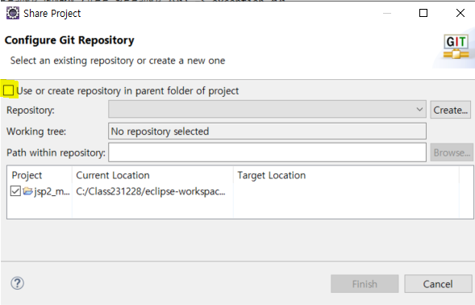


    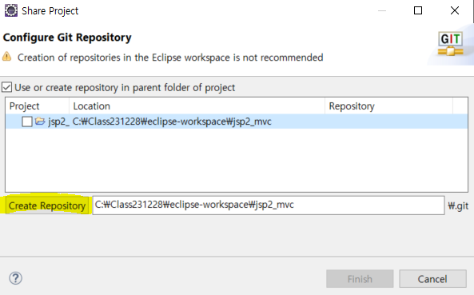

    


3. https://github.com/  New Repository 사용할 저장소 만들기

4. 이클립스 git Prespective 이동 > 프로젝트 선택 > Remotes 디렉토리 선택
    
    마우스 우 클릭 > Create Remote..
    
    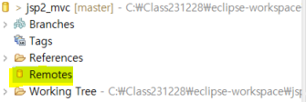 

5. Congiure fetch 선택 > Create 클릭

    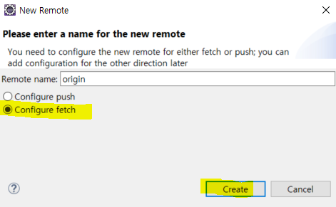

6. Change 클릭

    

7. URI에 git 사이트 repository 주소 붙여넣기 > Finish 클릭

    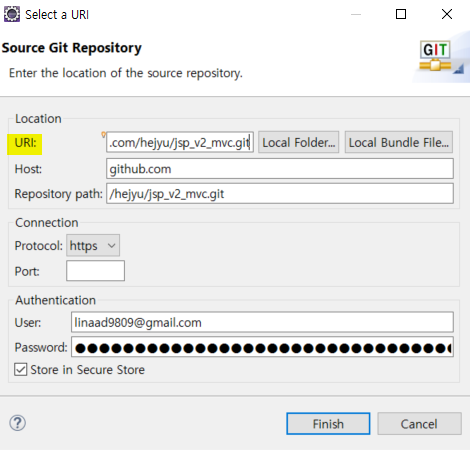
    
    - 선행 단계에 github 계정 토큰 발급 과정이 있음
        
        password 에 발급받은 토큰 입력
        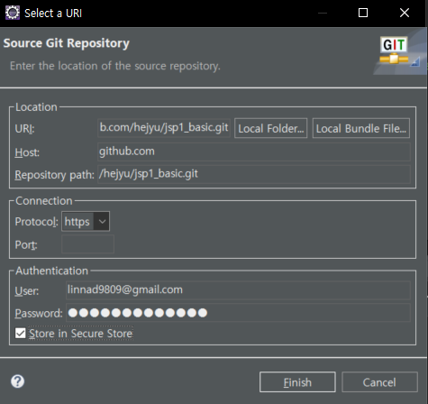

8. Save and Fetch 클릭

    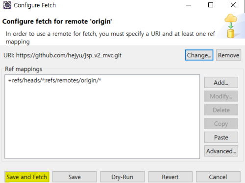

- 이클립스 Git Push 하는 법

    - Git perspective 이동

    - Remote 클릭 > origin 선택 > pull(초록색) 클릭 > 마우스 우클릭 > Fetch 선택

    - 디렉토리 선택 > pull.. 클릭 > Finish 클릭
    
        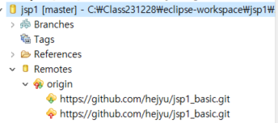


### 동적 웹 프로젝트 폴더 구조   
`src` >   `main`  > `java` : java 파일        
`src` >   `main`  >  `webapp` : html, css, js, jsp 파일, 외부 라이브러리(jar)

- 정적 자원 `assets 폴더` : `html,css, js, 이미지, 동영상` 에 저장 `
  
- 동적 자원 `웹용 라이브러리` : `WEB-INF` > `lib, jsp`

### JSP (Java Server Page)
- 발전 순서 : applet(애블릿) > servlet(서블릿) > JSP
- html 파일에 필요한 부분에만 자바를 쓸 수 있고 변수 출력 등을 출력할 수 있다  
- <% %> : 자바 코드 작성 할 수 있는 태그  
- `request` `response` `session` `out` 객체 제공 

#### HTTP 요청 파라미터 전달

#### JSP 파일의 형식

#### JSTL 태그(반복, 조건, 서식, 함수)

```jsp
<fmt:formatDate value="${vo.createdAt }" pattern="yyyy-MM-dd" var="createdAt"/> var : value  value="${vo.createdAt }" 저장(출력이 아님.)
```

#### 애트리뷰트와 EL

#### request 객체의 속성값 
    - 요청 URL
    - Context Path
    - 서버와 클라이언트
    - ip

#### 서블릿 클래스의 형식

#### forward : 서버측에서 웹페이지 전환하기 
    - 사용자 요청을 전달하므로 애트리뷰트 값을 jsp 로 보낼 수 있음.
    - forward 에서 사용한 객체 RequestDispatcher : jsp의 pageContext 역할

#### Redirect : 서버측에서 클라이언트가 다른 url을 재요청하도록 함

#### 요청 방식(메소드) GET 과 POST 

#### 애트리뷰트 : 서버에서 저장하는 Object 타입 데이터
- 스콥(Scope) , 사용 범위가 있습니다.
- 우리가 사용해 본 스콥 2개 : 현재 웹페이지(pageContext), 요청(request)
- 저장은 스콥객체.setAttribute()
- 읽기는 스콥객체.getAttribute()


### 서블릿 Servlet

- 서버에서 실행되다가 웹 브라우저에서 요청을 하면 해당 기능을 수행한 후 웹 브라우저에 결과를 전송(응답)하는데, 이러한 역할을 수행하는 자바 클래스

- 일반 자바 파일과는 다르게 자바 컴파일러만으로 실행되지 못하고 톹캣과 같은 Jsp / Servlet 컨테이너에서 실행된다 


### 서블릿 (Servlet) 클래스 

- 만드는 법
    - javax.servlet.http.`HttpServlet` 을 상속한다
- 특징 
    - 연결되는 url이 반드시 있다
        - url 이름은 중복되어선 안된다
        - 방법1) 애노테이션 사용  : @WebServlet(urlPatterns = {배열})
        - 방법2) web.xml 에서 servlet 태그로 설정하기
    - `HttpServletRequest` request : 요청  
    - `HttpServletResponse` response : 응답

    - jsp가 기본제공하는 객체는 요청,  응답 외에는 서블릿에서 직접 선언해서 사용합니다.
    - session : `HttpSession` 객체로 선언
    - out : `PrintWriter` 객체로 선언
- `HttpServletRequest 메소드`
    - request.getRequestDispatcher("URI")
    
    - request.setAttribute("뷰에서 받을 이름",자료형)

### 서블릿 생명주기(Life Cycle)
- init() : 메모리에 없을 때 요청을 받았다면 초기화 메소드로 가장 먼저 실행 됩니다.
- service() 
    - 요청이 있으면 실행되는 메소드
    - GET과 POST 모두 처리하며
	- service()메소드가 구현한 내용이 실행되면
        (HttpServlet @Ovirried 재정의 메소드로 정의되어 있으면)
        doGet() 또는 doPost()는 실행이 안됩니다.
- doGet() : Get 요청일 때 실행하는 메소드.
- doPost() : POST 요청일 때 실행하는 메소드
- destroy() : 메모리에서 서블릿이 제거가 될때 실행되는 메소드
- 일반적으로 service() 만 사용하거나 또는 doGet() 과 doPost() 만 사용합니다.


|서블릿|기능|요청메소드|서블릿 코드|응답JSP|
|---|---|---|---|---|
|CustomerServlet.java|고객전체조회|GET|dispatcher.forward(req, resp)|customers.jsp|
|ProductServlet.java|상품전체조회|GET|dispatcher.forward(req, resp)|products.jsp|
|BuyServlet.java|주문전체조회|GET|dispatcher.forward(req, resp)|buys.jsp|
|Register.java|고객등록-화면|GET|dispatcher.forward(req, resp)|register.jsp|
|Register.java|고객등록-저장|POST|response.sendRedirecct(url)|X, url 필요|
|ProductRegister.java|상품등록-화면|GET|dispatcher.forward(req, resp)|productReg.jsp|
|ProductRegister.java|상품등록-저장|POST|response.sendRedirecct(url)|X, url 필요|


### Mybatis 마이티스 프레임워크
- 자바코드와 관계형 데이터베이스가 상호작용 하는 방식을 관리하는데 도움을 주는 `자바 프레임워크`
- JDBC로 처리하는 코드와 파라미터 설정과 결과 코드를 대신 처리해준다.
- XML : Markup 언어, 태그를 사용하는 언어, 
HTML과 같이 태그를 사용하면서 데이터를 저장한다.
- 설정, 데이터 저장 목적으로 사용된다
- ex)  톰캣의 서버 port 설정은 결국은 server.xml 파일 내용

- `mybatis-config.xml`  : 데이터베이스 접속 환경 설정파일
    
    1) environments : 데이터베이스 Connection 환경셋팅
    ```xml
        <!-- 데이터베이스 서버 배포 개발, 테스트, 프로덕션 환경  설정-->
        <!--  -->
        <properties resource="mybatis/db.properties"/>

        <environments default="development"> 
            <environment id="development"> 
                <transactionManager type="JDBC"/>
                    <dataSource type="POOLED"> 
                        <property name="driver" value="${driver}"/>
                        <property name="url" value="${url}"/>
                        <property name="username" value="${username}"/>
                        <property name="password" value="${password}"/>
                    </dataSource>
            </environment>
        </environments>
    ```

    2) typeAliases : 마이바티스 SQL xml 파일 사용 `Object파일경로`, `사용할 별칭` 셋팅 
    ```xml
        <!-- 타입 별칭 설정하기 -->
        <!-- type = "Object 위치"  alias="사용할 별칭"-->
        <typeAliases>
                <typeAlias type="day4.mybatis.dto.BuyDto" alias="BuyDto"/>
                <typeAlias type="day4.mybatis.dto.CustomerDto" alias="CustomerDto"/>
                <typeAlias type="day4.mybatis.dto.ProductDto" alias="ProductDto"/>
                <typeAlias type="day4.mybatis.dto.CustomerBuyDto" alias="CustomerBuyDto"/>
        </typeAliases>
    ```
 
    3) mappers : 마이바티스 Mapper XML 위치 설정
    ```xml
        <mappers>
            <mapper resource="mybatis/buys.xml"/>
            <mapper resource="mybatis/customer.xml"/>
            <mapper resource="mybatis/product.xml"/>
        </mappers>
    ```
 - `SqlSessionBean.java` :  `mybatis-config.xml` 파일을 불러와 SQL xml 파일 읽어오는 파일

    ```java
    /*
    * Mybatis 라이브러리 기본 제공 객체
    *  - SqlSession : 데이터베이스 세션을 생성하는 객체 
    */
    public class SqlSessionBean {

        public static SqlSessionFactory sqlSessionFactory;

        static {
            String resource = "mybatis/mybatis-config.xml";     //mybatis 설정파일 org/example/demo/mybatis/mybatis-config
            InputStream inputStream=null;			            //파일을 읽기위한 입력 스트림
        
            try {
                inputStream = Resources.getResourceAsStream(resource);   //리소스 파일 자원 읽어옴
            }catch(IOException e) {
                System.out.println("mybatis 설정 파일 읽기 오류입니다.");
            }
            sqlSessionFactory = new SqlSessionFactoryBuilder().build(inputStream);   

        }
        
        // SqlSessionFactory 객체 
        // :dao에 필요한 Connection, PreparedStatement 자원 생성
        public static SqlSessionFactory getSessionFactory() {    
            return sqlSessionFactory;
        }
    }
    ```


### 마이바티스  특징
- 동적 검색필터 쿼리


### DTO DAO Sevlet JSP
- DTO : 데이터를 담는 그릇(객체)
- DAO : 데이터를 가져오는 그릇(객체)
- Servlet : Client의 요청을 처리하고 응답하는 서버
- JSP : 서버에서 보낸 데이터를 받을 수 있는 페이지

### MVC 2
- web.xml
    - 정적리소스 주소와 웹서블릿 주소 분리
    - HTTP error-code 404 페이지 설정
- Servlet
    

### 게시판 구현

### 파일 업로드 구현

## Maven : 빌드 도구
### 빌드

> 컴파일부터 시작해서 최종 소프트웨어 산출물 생성
- 최종산출물은 보통 압축파일 형태(패키징-포장)

> 종류
- .jar : 일반적인 자바 패키징 애플리케이션
- .war 

### Jackson 라이브러리 메소드
- **자바 객체 json 문자열로 변환** : **.writeValueAsString**

- **json 문자열을 자바 객체로 변환** : **.readValue**

### XHR 비동기 통신 메소드
- **직렬화**
    - **자바스크립트 객체를 json 문자열로 변환 : JSON.stringify**

- **역직렬화**
    - **json문자열을 자바스크립트 객체의 배열로 변환** : **JSON.parse(xhr.response)**

### 


### 빌드 도구 
**1. Maven** 

- 자바 프로젝트를 관리하는 툴
- 자바 소스를 컴파일하고 패키지해서 deploy까지 자동화 해준다.

    > 미리 작성된 pom.xml 파일을 이용하여 라이브러리를 자동으로 다운로드하거나 프로젝트를 빌드해줌.

- **Maven - 프로젝트 빌드 자동화 툴 프로젝트에 추가**    
    1. New > Product > Dynamic Web Project 클릭 > web.xml 생성 체크

        

    1. 프로젝트 우클릭 > Configure >Convert to Maven 클릭 >Finish


    1. `pom.xml` 의존성 추가 파일
        - **로컬 의존성 저장소 경로 : C:\Users\Administrator\\.m2\repository**
        - **추가한 의존성 다시 불러오기 : 프로젝트 우클릭 > Maven > Update Project**

- **Gradle**
    - 특징 : 의존성을 추가하는 방식이 maven 형식보다 짧다

## 자바스크립트 비동기 통신
> **동기식 통신 : 요청과 그에 대한 응답이 오고 그 이후에는 새로운 요청을 보낼 수 있는 방식**

- 서버와 통신을 하면 화면이 바뀐다. 화면은 서버가 보내는 응답이고 
그래서 응답을 받을 때까지 대기하는 시간이 오래 걸리기도 한다.

> **비동기식 통신 : 서버가 받은 요청을 응답을 기다리지 않고 새로운 요청을 보낼 수 있는 방식**
- 대표적으로 서버는 **rest api 방식**으로 데이터(응답)만 서버에 보내는 방식으로 동작한다.

- 관련 : **SPA(Single Page Application) 구현 방식**

> **비동기 통신 객체  XHR (XMLHttpRequest)로 인터페이스 개발 예시**

```javascript
const selectAll = function() {
	const xhr = new XMLHttpRequest()		// 비동기 통신 객체 생성
	xhr.open('GET', 'api/buy/list')			// 전송 보낼 준비 (url 과 메소드)
	xhr.send()								// 요청 전송
	xhr.onload = function() {				// 요청에 대한 응답을 받았을 때 onload 이벤트가 생긴다. onload 핸들러 함수
		if(xhr.status === 200 || xhr.status === 201) { // readyState Done
			//json 문자열 웅답을 
            //자바스크립트 배열 객체로 변환하여 
            //요소 하나씩을 ele 변수에 대입한 후
			//화면에 값을 태그요소에 출력하는 코드
            
            const arr = JSON.parse(xhr.response)		// 응답받은 json문자열 {} -> 자바스크립트 객체의 배열 [] 로 변환(역직렬화)

			const list = document.querySelector('#list')
			list.innerHTML=''
			arr.forEach((ele,index) => {
				const li = document.createElement('li')
				const ul = document.createElement('ul')
				ul.className = 'row'
				ul.innerHTML = 
				`<li>${index+1}</li>
				<li>${ele.customid}</li>
				<li>${ele.pcode}</li>
				<li>${ele.quantity}</li>
				<li style=\"text-align: right; \">${ele.buy_date}</li>`
				
				li.appendChild(ul)
				list.appendChild(li)
			})
					
		} else {
		 	console.log('error 1 ', xhr.status)
		 	console.log('error 2 ', xhr.response)
		}
	}
}


```
### Git PR ( Pull Request )


### 웹 애플리케이션 배포


이클립스 개발환경에서 실행해 온 프로젝트를
운영환경에서 실행될 수 있도록 애플리케이션 설치 과정
빌드 도구에 따라 jar 또는 war 파일 생성 명령이 다르지만,
과정은 `빌드`가 꼭 필요한 점은 같다.
(jar,war 파일 형식은 압축 파일의 형식, 압축과정을 패키징이라고도 한다)

- 준비
1. 프로젝트 준비
1. 톰캣 설치(zip 압축  해제 상태)
1. maven 빌드도구 - build 명령 또는 방식을 알아놓기
    
    -  이클립스 `run as`  > `maven build ...` 선택

- 체크 리스트
    
    

    - `offline` : 새로 다운로드 받지 않고 로컬 저장소에서 라이브러리를 가져옴을 의미
    - `skip test` : junit 테스트를 통과해야만 빌드 완료할 것을 의미
   - Goals 실행할 build 명령 : `clean package` 

진행 순서
1. war 파일을 생성한다
1. tomcat 디렉토리  WAS 설정 : PORT, 콘솔 인코딩
    
    - conf 폴더 : serverl.xml - port 변경, 파일업로드 경로 변경

    ```xml
    <Connector port="8088" protocol="HTTP/1.1"
               connectionTimeout="20000"
               redirectPort="8443"
               maxParameterCount="1000"
               />
    <Context docBase="C:/Class231228/upload" path="/upload" /> 
    ```
    
    - logging.properties에서 인코딩 변경

    ```properties
    java.util.logging.ConsoleHandler.encoding = MS949
    ```

1. tomcat 실행 파일 > bin 디렉토리 : startup.bat
   tomcat 종료 파일 > bin 디렉토리 : shutdown.bat 

1. war 파일을 tomcat에 배포한다
    - war 파일을 webapps 디렉토리에 복사하면 자동으로 압축이 풀리면서 폴더가 만들어지고 배포완료 메시지가 콘솔에 출력됩니다. 
    
    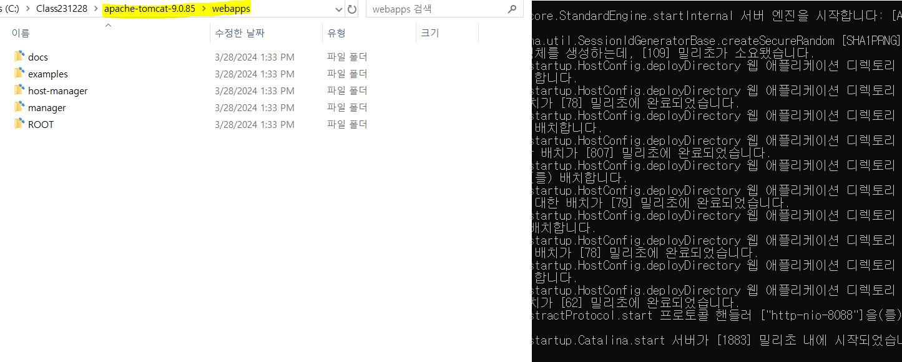

    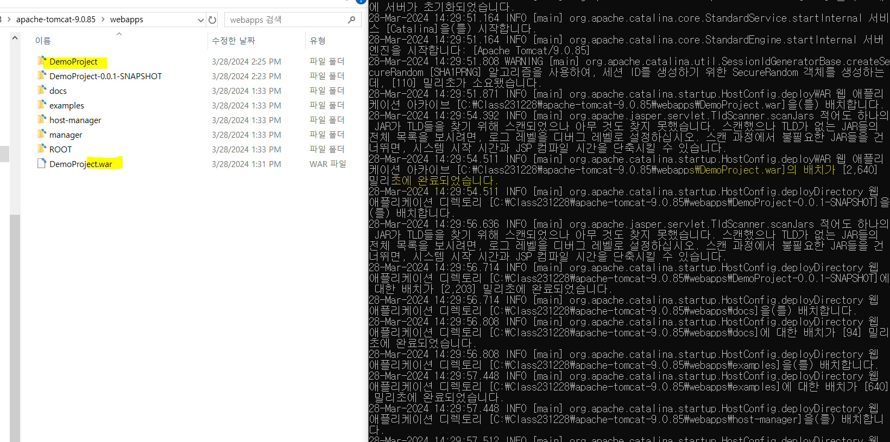

1. 실무에서는 많은 서버에 애플리케이션을 배포하는 과정에 많은 시간이 소요되므로 배포 도구가 별도로 사용됩니다

